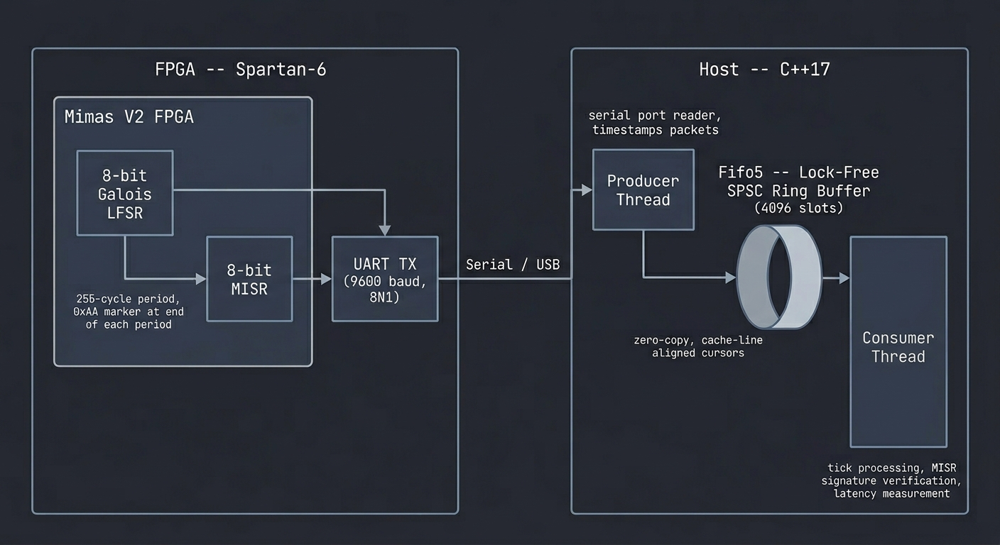

# FPGA LFSR Tick Stream Generator

A hardware-software system that generates a continuous pseudo-random data stream on an FPGA and consumes it on a host machine through a lock-free queue. The FPGA runs an 8-bit Galois LFSR paired with a MISR (Multiple Input Signature Register) for integrity checking, transmits byte pairs over UART, and a C++ application reads the stream into a lock-free ring buffer for downstream consumption by an order book builder.

Built for the Numato Mimas V2 (Xilinx Spartan-6) FPGA board.

## Overview

The system has two halves:

1. **FPGA side** -- A Verilog design that runs a Galois LFSR to produce pseudo-random bytes, feeds them into a MISR for signature accumulation, and sends both values over UART at 9600 baud. After every 255 cycles (the maximal-length period of an 8-bit LFSR), a `0xAA` marker byte is transmitted and the MISR is reset. The current LFSR state is also displayed on the board's LEDs.

2. **Host side** -- A C++17 application with a producer thread that reads LFSR+MISR byte pairs from the serial port and pushes them into a lock-free SPSC ring buffer. The consumer side (order book builder) pops packets from the queue and is responsible for interpreting tick data and constructing the order book.




## FPGA Design

The Verilog design consists of four modules:

| Module | Description |
|---|---|
| `galois_lfsr_8` | 8-bit Galois LFSR with feedback polynomial x^8 + x^6 + x^5 + x^4 + 1 (taps at bits 6, 5, 4). Seed value `0xFF`. Produces a maximal-length sequence of 255 unique states. |
| `misr_8` | 8-bit Multiple Input Signature Register. Same feedback polynomial as the LFSR, but XORs in external data at each step. Accumulates a running signature over the LFSR output sequence. |
| `uart_tx` | Simple UART transmitter. Configurable clock frequency and baud rate (default 100 MHz / 9600 baud). Sends 8N1 frames. |
| `top` | Top-level state machine. Sequences the transmission of LFSR byte, MISR byte, and the end-of-period marker. Drives the LEDs with the current LFSR state. |

The state machine in `top.v` cycles through: send LFSR byte, wait for TX, send MISR byte, wait for TX, advance both registers, and repeat. Every 255 cycles it sends the `0xAA` marker and resets the MISR.

### Architecture Diagram

The `Architecture/` directory contains a gate-level diagram of the LFSR and MISR register chains, showing the feedback taps and XOR connections.

## Host Side

### FPGA Tick Consumer (Producer)

`fpga_consumer/fpga_tick_consumer.cpp` is the producer half of the host pipeline. It does the following:

- Opens the serial port in raw 8N1 mode at 9600 baud
- Computes the expected (golden) MISR signature in software by simulating the same LFSR+MISR algorithm
- Reads LFSR+MISR byte pairs from the serial port, timestamps them, and pushes `TickPacket` structs into the lock-free ring buffer
- Verifies the MISR signature against the golden value at the end of each 255-cycle period
- Reports throughput, queue transit latency (median, p99, p99.9), signature verification results, and queue contention statistics

### Order Book Builder (Consumer)

`orderbook/orderbook_builder.cpp` is the consumer half. It pops `TickPacket` structs from the ring buffer and builds the order book. The order book data structure is defined in `orderbook/orderbook.h`. This component is currently under development.

### Lock-Free SPSC Ring Buffer

The inter-thread queue is a single-producer single-consumer lock-free ring buffer (`Fifo5`), written from scratch. It uses cache-line-aligned cursors, bitwise masking for index computation (power-of-2 capacity), and a zero-copy RAII proxy API -- the producer writes directly into queue memory through a `pusher_t` handle, and cursor advancement happens automatically in the destructor.

The queue has been benchmarked separately using `rdtsc`/`rdtscp` cycle counting. The full implementation and benchmarks are available in their own repository:

**[lockfree-spsc-ring-buffer](https://github.com/RishitSharma88/lockfree-spsc-ring-buffer)**

## Project Structure

```
.
├── verilog/                        # FPGA design
│   ├── top.v                       # Top-level state machine
│   ├── galois_lfsr_8.v             # 8-bit Galois LFSR
│   ├── misr_8.v                    # 8-bit MISR
│   ├── uart_tx.v                   # UART transmitter
│   └── constraints.ucf             # Pin constraints for Mimas V2
├── fpga_consumer/                  # FPGA serial reader (producer into queue)
│   ├── fpga_tick_consumer.cpp      # Serial reader + queue producer
│   └── Makefile
├── orderbook/                      # Order book builder (consumer from queue)
│   ├── orderbook.h                 # Order book data structure
│   └── orderbook_builder.cpp       # Queue consumer + book construction
├── SPSC_lockfree_ring_buffer/      # Lock-free queue (Fifo5)
│   ├── fifo5.h                     # Ring buffer implementation
│   └── main.cpp                    # Benchmark and test suite
├── Architecture/                   # Architecture diagrams
│   ├── LFSR_Architecture.png       # Gate-level LFSR + MISR diagram
│   └── System_Architecture.png     # System-level pipeline diagram
└── UART_Project_With_PushButtons/  # Separate UART reference design
```

## Building and Running

### Requirements

- Xilinx ISE (for synthesizing and programming the FPGA)
- Numato Mimas V2 board (or any Spartan-6 board with UART -- adjust constraints accordingly)
- C++17 compiler (clang++ or g++)
- POSIX-compatible OS (macOS or Linux) for the serial port interface

### FPGA

Synthesize the Verilog design in Xilinx ISE using the files in `verilog/` and the provided `constraints.ucf`. Program the resulting bitstream onto the Mimas V2 board.

### Host Consumer

```bash
cd fpga_consumer
make
./fpga_consumer /dev/cu.usbserial-XXXX    # macOS
./fpga_consumer /dev/ttyUSB0               # Linux
```

The consumer will stream data until you press Enter, then print a summary of ticks processed, latency statistics, and MISR verification results.

## How MISR Verification Works

The LFSR produces a deterministic sequence from its seed. Because the sequence is fixed, the MISR -- which folds each LFSR output into a running signature -- will always arrive at the same value after exactly 255 steps. The host computes this expected value in software at startup. If the received MISR byte at the end of any period does not match, it indicates data corruption somewhere in the path (FPGA logic fault, UART framing error, or serial link noise).

